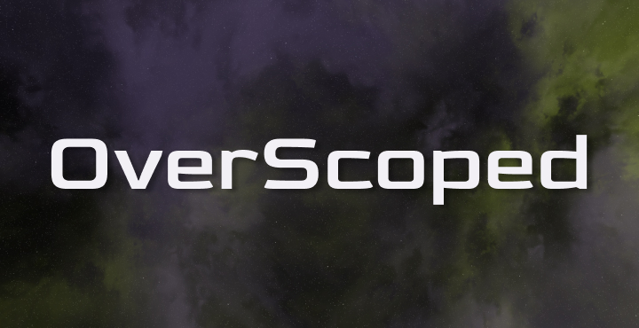

# OverScoped

<p align="center">
  
</p>

OverScoped is a game project developed with Unreal Engine 5.4.4 as part of a course on Unreal Engine.

## Table of Contents
- [About](#about)
- [Setup](#setup)
- [Building & Running](#building--running)
- [Project Structure](#project-structure)
- [Contributing](#contributing)
- [License](#license)

## About
OverScoped is an Unreal Engine 5 project created for educational purposes in the context of a course. The project aims to demonstrate best practices and core concepts of game development using Unreal Engine 5.

## Setup
1. Install Unreal Engine 5 (recommended version: 5.4.4).
2. Clone this repository:
	```powershell
	git clone https://github.com/Orrigine/OverScoped.git
	```
3. Open `OverScoped.uproject` with Unreal Engine 5 Editor.

## Building & Running
To build and run the project:
1. Open the project in Unreal Engine Editor.
2. Click 'Play' to test in-editor, or package the project for your target platform.

## Project Structure
- `Source/` - C++ source code
- `Content/` - Game assets (Blueprints, Levels, UI, etc.)
- `Config/` - Project configuration files
- `Binaries/` - Compiled binaries
- `Intermediate/` - Build intermediates
- `Plugins/` - Third-party or custom UE used by the project
- `Saved/` - Autosaves, logs, and crash reports

## Contributing
We use Gitmoji for commit messages to make contributions more expressive and clear. Please follow the Gitmoji convention: https://gitmoji.dev/

Pull requests are welcome. For major changes, please open an issue first to discuss what you would like to change.

## License
This project is licensed under the MIT License. See the [LICENSE](LICENSE) file for details.

## Acknowledgments
This project was carried out by a team consisting of:
- Channia Chan Haor King
- Valentin Faguet
- Noa Second
- Antoine Fasquel